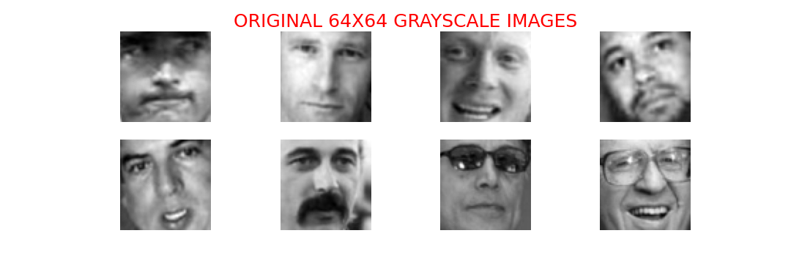
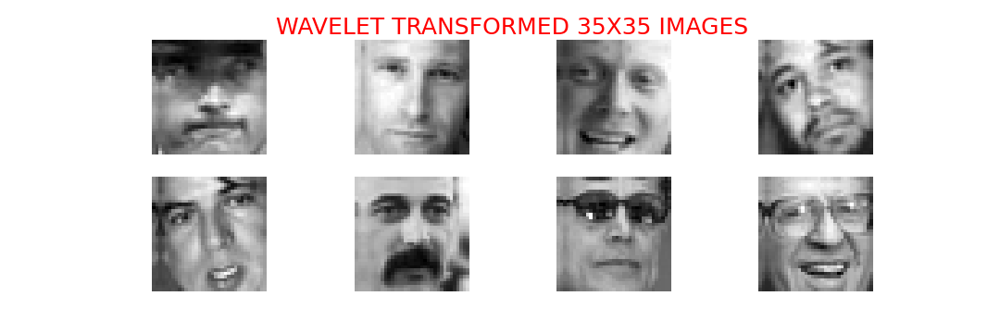

<h1 align="center">Face Recognition using Wavelet Transformed Neural Evolution</h1>
<h4 align="center"> Aman Mishra (ECE), Megha Garg (SMST) </h4>

### ABSTRACT

Face Recognition involves matching features of a given face to the ones present in database and verifies the person present or not. It is a well studied problem in Computer Vision community. Most of the features are redundant in facial images, so we are proposing a genetic based feature selection technique to choose best set of eigen vectors extracted from PCA. We worked on DB4 wavelet of given image instead of working on direct image to reduce PCA computational complexity. Moreover, we used, 2-layered siamese net on top of the selected features to perform one-shot recognition.

For more info, visit the presentation link - [HERE](https://docs.google.com/presentation/d/1AGOhOAvEGNLaVtMC0lDCtJAKBcsxksVG_VoXxjM_Ec8/edit?usp=sharing
)

### NOVEL TECHNIQUES USED :-

 - **WAVELET TRANSFORMATION** - To reduce computational complexity for PCA Calculations

    Result :-

     </br>
     </br>

 - **EVOLUTIONARY ALGORITHM** - To select eigen-vectors based on the genetic fitness.

## Requirements

 - python>3.7</br>
 - OpenCV
 - numpy
 - pywavelets
 - torch>=1.8.0 (With CUDA 11.1)
 
 For installing all the above and other requirements easily, run ```pip install -r requirements.txt``` 

## Instructions

 * Clone this Repo
```bash
git clone https://github.com/tech-wiz18/Soft-Computing.git
```

### Dataset

We used **LFW-Cropped**(Labelled Faces in the Wild Cropped) dataset as our standard face recognition dataset.

```bash
## run following commands to download dataset in the folder (Colored version)

cd Soft-Computing
wget https://conradsanderson.id.au/lfwcrop/lfwcrop_color.zip 
unzip lfwcrop_color.zip
```

### DATA-STRUCTURING

TO properly arrange dataset in train-test we used [THIS NOTEBOOK](notebooks/data_prepare.ipynb)

 - Used (80-20) Splitting ratio.
 - Keep only those person which are having more than one images.

 **DEMO IS PRESENT IN THIS [NOTEBOOK](notebooks/nn.ipynb)**


## References
 * [WHAT ARE WAVELET TRANSFORMS?](https://en.wikipedia.org/wiki/Wavelet_transform)
 * [pywavelet docs](https://pywavelets.readthedocs.io/en/latest/ref/2d-dwt-and-idwt.html#ref-dwt2) - Wavelet Transformation Library for python.
 * [Sklearn PCA](https://scikit-learn.org/stable/modules/generated/sklearn.decomposition.PCA.html)